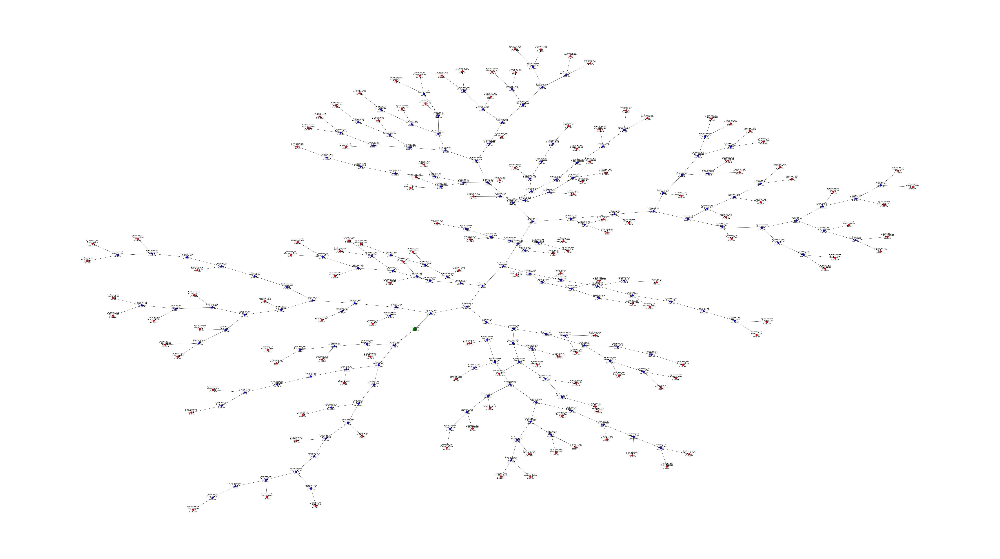
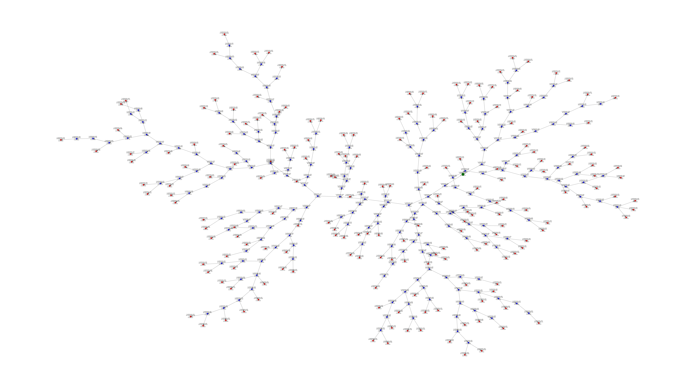
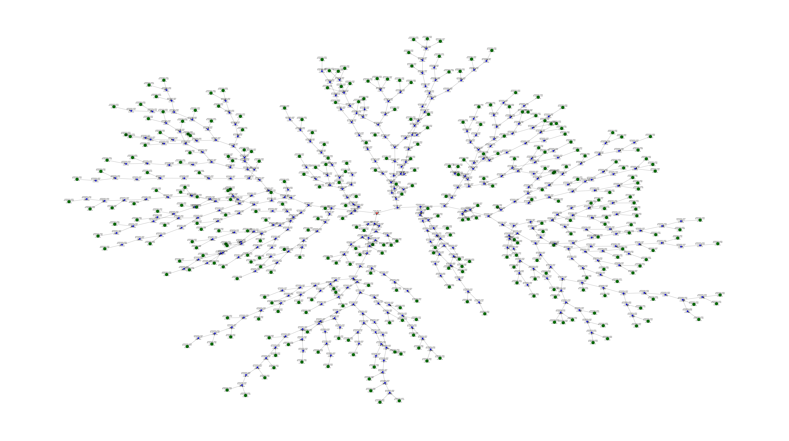
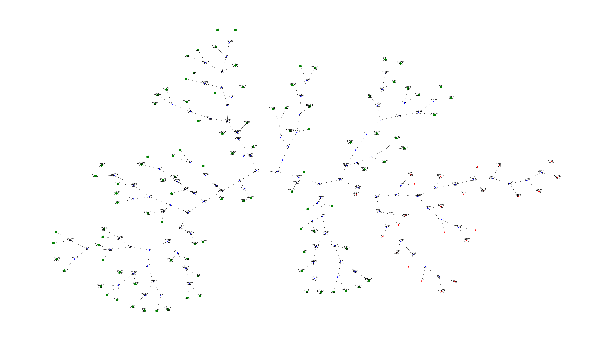
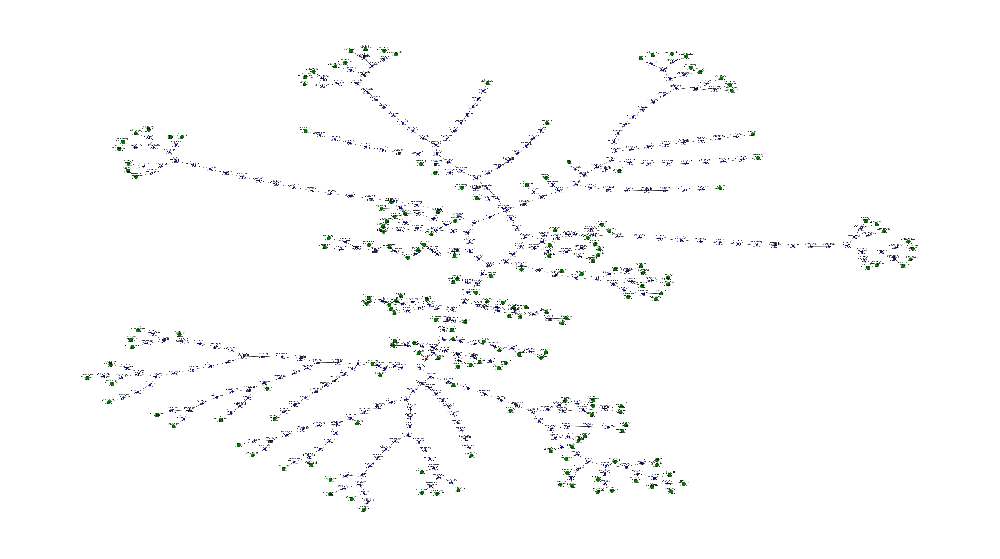
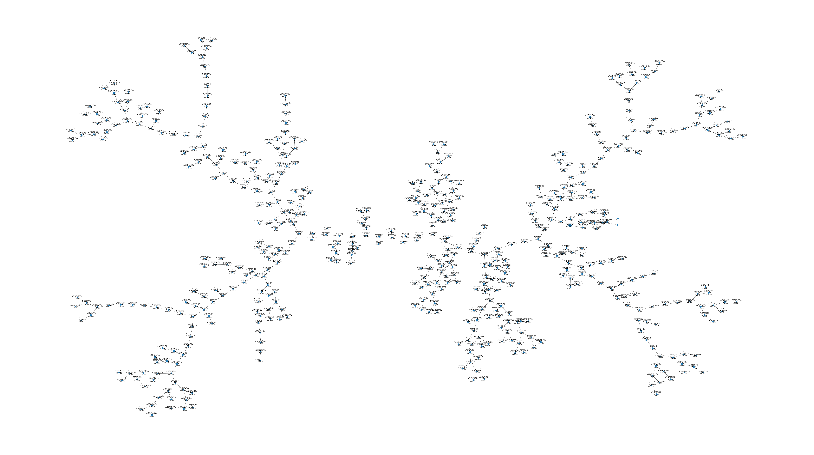

This repository contains the code used for the submission of the CeFloPS tool.
Due to licensing we cannot provide model files. 
To substitute for that we will include a simple synthetic simulation setup that may be used to validate the simulation in the near future.

# Methodology:

In the following VOI and ROI might be used interchangably, ROI in the context of simulations, VOI more in the context of the preprocessing of geometry data.

## Vessel creation scripts:

This script works for shapes that are defined and recognised by the trimesh library as waterproof. This is a necessity for the splitting of singular vessels if multiple not connected vessels are defined in one file.
The splitting and information extraction is started via the script `vessel_extract.py` under the scripts folder. The setting variable `PATH_TO_STLS` is used in this process.
If there is a file where that doesnt work, one can employ poisson disk sampling using the script `remesher.py`.
After shapes and vessel information are extracted, intersection information is extracted using quick bounding box checks and if possible, calculation of intersection points.

The Vessel connection code with flow calculation then uses the intersection points and extracted vessel data. This is done within 3 files :

`CeFloPS/data_processing/combine_vessels_nw.py`: Combination of vessels to one network, we obtain 6 different interconnected structures (3xpulmonary(1V,2A), 2xBody (A,V), 1xLiver):

| Lung and Liver         | Body Arteries and Veins           |
|------------|------------------|
|           |        | 

 
`CeFloPS/data_processing/combine_vessels_graph.py`:
Combines the networks to one network, adding in a "built-in" VOI-structure for the heart area.
It might be adapted manually depending on how intersections are to be handled. There are edge cases like vessels that overlap on their ends (which means one end must be shortened), sometimes with 3 overlapping. The whole procedure is thus defined in a jupyter notebook for quick inspection and corrections if necessary.

`CeFloPS/notebooks/roiconnect_scriptbook.py`:
Calculates index-index connections between vessels and loaded VOIs that are short and logical. This has potential for further automisation. Also flowfields are connected and mappings to region names and the final model structure are saved. The VOI representation is done via caching of their geometry after subtracting necessary excluded volumes and their flowinformation to keep the filesize of the final_rois data small and allow for fast repeated simulations.

# Result creation:

To start a simulation we first need to fit our rates, this can be done via the script found in the scripts folder. One has to know a few transition rates for the specific tracer one want to simulate and the input function used for fitting. Hardcoded is one that used these 2 papers average values:

    E.  J.  Li,  B.  A.  Spencer,  J.  P.  Schmall,  Y.  Abdelhafez,  R.  D.  Badawiet  al.,  “Efficient  delay  correction  for  total-body  PET  kinetic  modelingusing  pulse  timing  methods,”Journal  of  Nuclear  Medicine,  vol.  63,no. 8, pp. 1266–1273, 2022.
  
    G.  Liu,  H.  Xu,  P.  Hu,  H.  Tan,  Y.  Zhanget  al.,  “Kinetic  metrics  of18f-FDG  in  normal  human  organs  identified  by  systematic  dynamictotal-body positron emission tomography,”European Journal of NuclearMedicine and Molecular Imaging, vol. 48, no. 8, pp. 2363–2372, 2021.

## Simulation code:
The simulation is started via `parallel_simulate.py` script.
Objects are defined in the simulation folder and the ones of main interest are simulations, distributors, vessels, links, volumes, rois.
Explanation:
Every Simulation uses a `distributor` object that specifies how and where cells are to be injected. A single `simulation` object is expected to exist per process started from the `parallel_simulate` script. These are partial simulations which results are merged upon completion. This is viable because the cells themselves at the moment do not interact with each other but only depend on the model and time.
The model consists of `vessels` and `Rois`, `Rois` are in this case mainly organs, but can also be muscles or any region of interest defined by an stl file. Links represent the connections between them, vessels are represented by discrete positional node sequences and `Rois` over voxelgrids, so links simply create associations between both over indices of their representative data structure.
Volumes are part of vessels and represent the volume per node, e.g. the pipe segments that make up the vessel and are used to calculate flow and later sample cells position and speed within the vessel network.

## Settings file:
Settings for the simulation and preprocessing are specifyable via yaml files in the `CeFloPS/simulation/settings` directory. In setting_loader.py the most often used variables can be quickly overriden.
In the same folder, different fitted input/elimination curves can be found. The naming format is as follows:
pkode_injend0.16666666666666666_injw2.00_tailw10.00_tailfrom40.0.pt

injend0.16666666666666666: injection ends after 0.16 minutes: 10 seconds
injw2.00: the injection part of the input function gets a weight of 2
tailw10.00: the tail part of the input function gets a weight of 10
tailfrom40.0: the functions tail is assumed to be starting at time 40 minutes.

This is one of the combinations that for our k rates, gives a closely matching resulting function. Early stopping was (not really) used with a patience of 30, so that most accurate injection and elimination rates could be found.

 ## License

This project is licensed under the MIT License and makes use of third party libraries.

For details and full license text, see the LICENSE file.